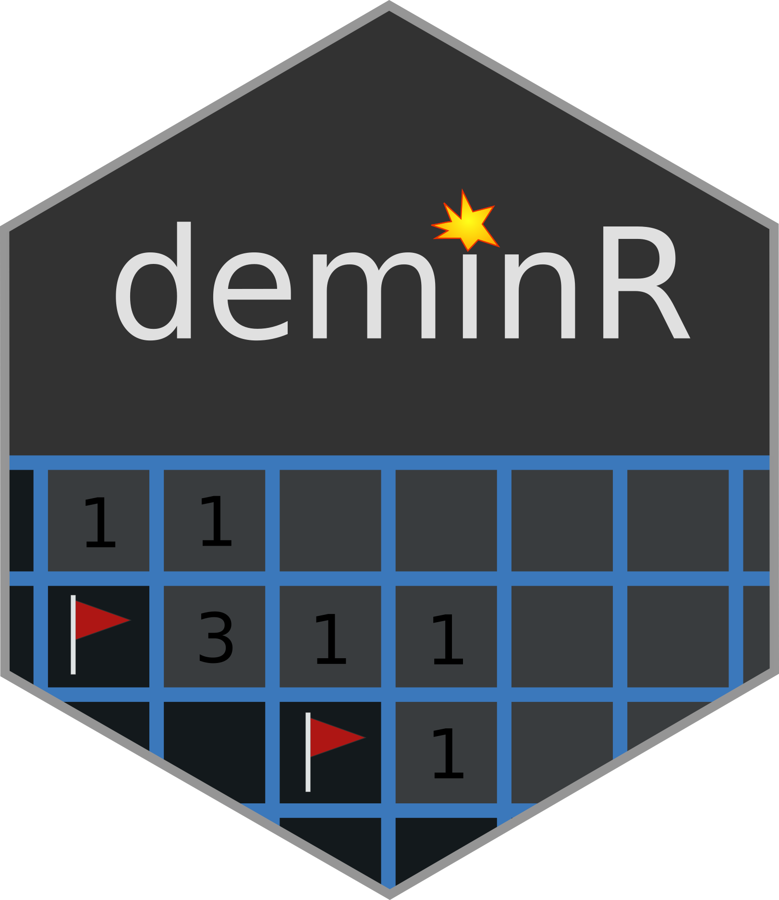
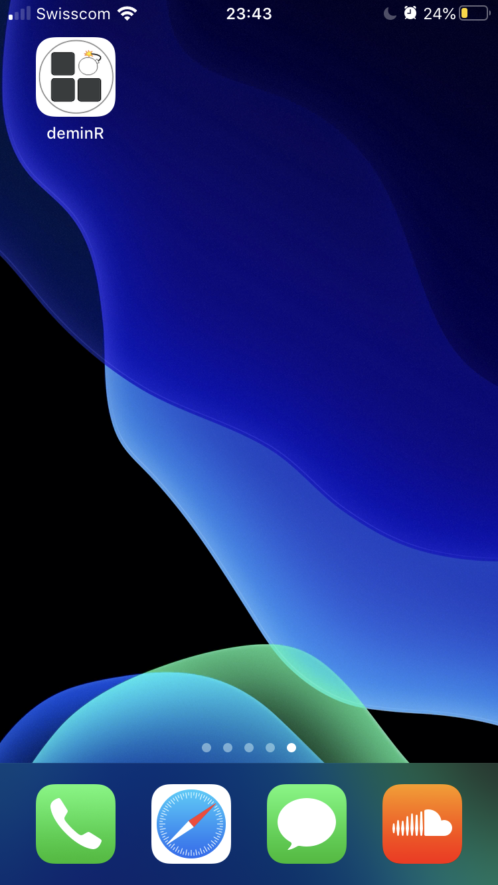
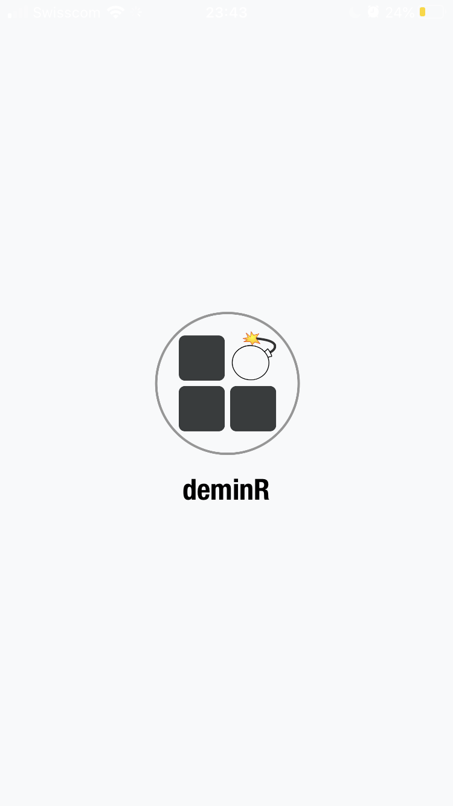

<div align="center">



[](https://travis-ci.org/DivadNojnarg/deminR)
[](https://CRAN.R-project.org/package=deminR)
[](https://www.tidyverse.org/lifecycle/#experimental)
[](https://dgranjon.shinyapps.io/deminR)
[](https://rstudio.cloud/project/1032373)


</div>

## Installation

You can install the devel version of deminR from [github](https://github.com/DivadNojnarg/deminR) with:

``` r
remotes::install_github("DivadNojnarg/deminR")
```

### Make it full screen on your mobile? (PWA)
This is one of the greatest feature of shinyMobile. Below are the steps to follow (iOS, ipadOS):

1                          |  2                        |  3                       
:-------------------------:|:-------------------------:|:-------------------------:
  |    |    

4                          |  5
:-------------------------:|:-------------------------:
  |  

For Android devices, it is recommended to use Chrome and the process is similar. 
(Note that Chrome for iOS does not support the add to homescreen feature.)

If for any reason the app crashes, you may kill it like a classic mobile app and restart!

## Getting Started

Welcome to deminR, the R version of the [Minesweeper](https://en.wikipedia.org/wiki/Minesweeper_(video_game)). The goal is simple : flag all the mines as quick as possible by clicking on the grid. While this app is optimized for mobile use, it also works on desktop.
Note that since the right click on desktop platforms is replaced by a long press for mobiles which takes more time, scores are categorized by devices.
As soon as you click on a mine, the game is immediately lost. You may reset the game at any time when the timer is on by clicking on the option button in the navigation bar. After a success, the score may be shared on twitter (as long as you have a twitter account).

Welcome screen             |  Main tab                 | Game win                   |  Game fail
:-------------------------:|:-------------------------:|:-------------------------:|:-------------------------:
  |    |    |  

The game currently has 3 difficulty levels: beginner, intermediate and expert. There is a fourth mode, namely the warrior mode, which significantly increases the challenge. A chat is included so that people may share their experience. 

Game options             |  Game parameters           |  Scores list                |  Dynamic chat
:-------------------------:|:-------------------------:|:-------------------------:|:-------------------------:
  |    |    |  

Finally, you can change the global theme from dark (default) to light and inversely.

Theme light               |  Theme light               |  Theme light
:-------------------------:|:-------------------------:|:-------------------------:
  |    |  

We wish you a lot of fun!

## Limitations

When launched from desktop in local mode, some icons may not display as expected.

## Example

Once installed, you may play the deminR as shown below:

``` r
library(deminR)
## basic example code
run_app(usecase = "local")
```

You could also embed the app in a `runGadget` function:
```r
runGadget(run_app(usecase = "local"))
```

There is a "database" usecase which require a PostgreSQL database to be launched.

## Database
deminR is linked to a [Postgres](https://www.postgresql.org) database containing (at the moment) 2 tables:
- scores
- messages for the chat

To create the scores table, one might use:

```sql
CREATE TABLE scores (
  nickname varchar NOT NULL,
  difficulty varchar (25) check (difficulty in ('Beginner', 'Intermediate', 'Advanced')),
  score float (2) NOT NULL,
  date varchar NOT NULL,
  device varchar NOT NULL
);
```

and similarly for the messages table:

```sql
CREATE TABLE messages (
  nickname varchar NOT NULL,
  message varchar NOT NULL,
  date varchar NOT NULL
);

INSERT INTO messages (nickname, message, date) VALUES ('bobby', 'My amazing message', '2020-03-04');
```


## Credits
* The package structure was made with the package [Golem](https://github.com/ThinkR-open/golem) 
* The package UI is powered by [shinyMobile](https://github.com/RinteRface/shinyMobile)
* The smileys used in the help section were created by [Conmongt](https://pixabay.com/fr/users/conmongt-1226108/)

