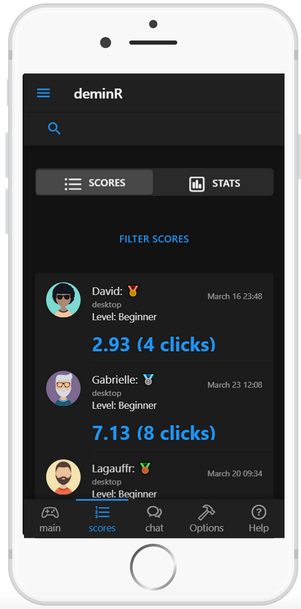

# deminR

[](https://travis-ci.org/DivadNojnarg/deminR)
[](https://CRAN.R-project.org/package=deminR)
[](https://www.tidyverse.org/lifecycle/#experimental)


## Installation

You can install the devel version of deminR from [github](https://github.com/DivadNojnarg/deminR) with:

``` r
remotes::install_github("DivadNojnarg/deminR")
```

## Getting Started

<div class="row">
<div class="col">
<div class="card">
<a href="#" target="_blank"></a>
</div>
</div>
<div class="col">
<div class="card">
<a href="#" target="_blank"></a>
</div>
</div>
</div>


<div class="row">
<div class="card">
<a href="#" target="_blank"></a>
</div>
<div class="card">
<a href="#" target="_blank"></a>
</div>
</div>


<div class="row">
<div class="card">
<a href="#" target="_blank"></a>
</div>
<div class="card">
<a href="#" target="_blank"></a>
</div>
</div>


<div class="row">
<div class="card">
<a href="#" target="_blank"></a>
</div>
<div class="card">
<a href="#" target="_blank"></a>
</div>
</div>


<div class="row">
<div class="card">
<a href="#" target="_blank"></a>
</div>
<div class="card">
<a href="#" target="_blank"></a>
</div>
</div>

## Example

Once installed, you may play the deminR as shown below:

``` r
library(deminR)
## basic example code
run_app()
```

## TO DO
- [x] add new reactiveValue in r to know the current device (David)
- [ ] double click or long press for mobile? (Discuss)...
- [x] group_by devices (Gab) 
- [ ] maybe add other data ... (Gab + David)
- [x] Finish help section (Gab)
- [x] UI issue: chip in navbar not properly aligned in some cases (if timer > 100s, if user name lenght...)
- [ ] optimize UI (Gab + David)


