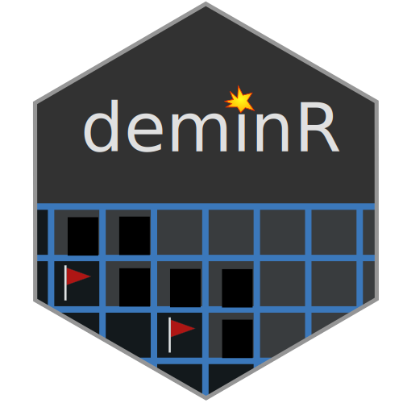

<div align="center">



[](https://travis-ci.org/DivadNojnarg/deminR)
[](https://CRAN.R-project.org/package=deminR)
[](https://www.tidyverse.org/lifecycle/#experimental)

</div>

## Installation

You can install the devel version of deminR from [github](https://github.com/DivadNojnarg/deminR) with:

``` r
remotes::install_github("DivadNojnarg/deminR")
```

### Make it full screen on your mobile? (PWA)
This is one of the greatest feature of shinyMobile. Below are the steps to follow (iOS, ipadOS):

1               |  2              |  3
:-------------------------:|:-------------------------:|:-------------------------:
  |    |  

For Android devices, it is recommended to use Chrome and the process is similar. 
(Note that Chrome for iOS does not support the add to homescreen feature.)


## Getting Started

Welcome to deminR, the R version of the [Minesweeper](https://en.wikipedia.org/wiki/Minesweeper_(video_game)). The goal is simple : flag all the mines as quick as possible by clicking on the grid. While this app is optimized for mobile use, it also works on desktop.
Note that since the right click on desktop platforms is replaced by a long press for mobiles which takes more time, scores are categorized by devices.
As soon as you click on a mine, the game is immediately lost. You may reset the game at any time when the timer is on by clicking on the option button in the navigation bar. After a success, the score may be shared on twitter (as long as you have a twitter account).

Welcome screen             |  Main tab                 | Game win                   |  Game fail
:-------------------------:|:-------------------------:|:-------------------------:|:-------------------------:
  |    |    |  

The game currently has 3 difficulty levels: beginner, intermediate and expert. There is a fourth mode, namely the warrior mode, which significantly increase the challenge. A chat is included so that people may share their experience. 

Game options             |  Game parameters           |  Scores list                |  Dynamic chat
:-------------------------:|:-------------------------:|:-------------------------:|:-------------------------:
  |    |    |  

Finally, you can change the global theme from dark (default) to light and inversely.

Theme light               |  Theme light               |  Theme light
:-------------------------:|:-------------------------:|:-------------------------:
  |    |  

We wish you a lot of fun!

## Limitations

TO DO...

## Example

Once installed, you may play the deminR as shown below:

``` r
library(deminR)
## basic example code
run_app()
```

## TO DO
- [x] add new reactiveValue in r to know the current device (David)
- [ ] double click or long press for mobile? (Discuss)...
- [x] group_by devices (Gab) 
- [ ] maybe add other data ... (Gab + David)
- [x] Finish help section (Gab)
- [x] UI issue: chip in navbar not properly aligned in some cases (if timer > 100s, if user name lenght...)
- [ ] optimize UI (Gab + David)


