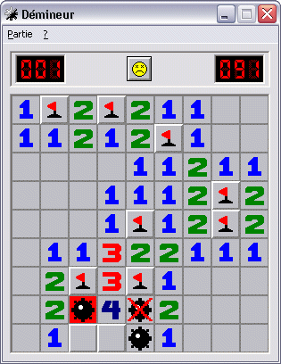
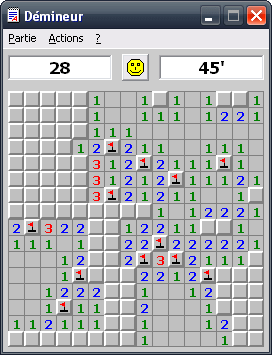

```{r setup, include=FALSE}
knitr::opts_chunk$set(echo = TRUE)
```

## Principe du jeu

Le démineur est un jeu de réflexion dont le but est de localiser des mines cachées dans les cases d'une grille. 
Il se joue à un seul joueur.
Des bombes sont disséminées sur une grille rectangulaire et le but du jeu est de trouver leurs positions. 
Au début du jeu toutes les cases sont cachées, puis on les découvre petit à petit en cliquant sur celles-ci. 

Chaque case cachée contient soit :

- une mine
- le nombre de mines adjacentes à la case (0, 1, 2, 3 ...)

Lorsque l'on clique sur une case avec le bouton gauche de la souris il y a deux possibilités:

- si la case contient une mine, toutes les cases minées restantes sont révélées et la partie est perdue
- si la case n'est pas minée, elle est révélée et indique le nombre de mines adjacentes. Si le nombre est 0, alors les cases adjacentes sont révélées également.

Si le clic a été effectué à l'aide du bouton droit alors on marque une mine à la position donnée. 
Si toutes les mines ont été marquées alors la partie est gagnée. 
Attention, si une case sans mine a été marquée alors la partie n'est pas gagnée.

Partie perdue              |  Partie en cours
:-------------------------:|:-------------------------:
  |  


Les cases grises sont les cases non découvertes.
Les cases chiffres qui ont été découvertes et indiquent le nombre de mines dans les cases adjacentes.
Les cases drapeaux indique que l'utilisateur considère cette case comme étant minée.
Si une case minée est cliquée, les mines non trouvées sont révélées et la partie est perdue.

La partie est chronométrée et le score du joueur est représenté par le temps qu'il a mis à gagner la partie. Plus le temps est petit, et meilleur est le score. 
Les parties perdues n'ont pas de score.


## Implémentation en R

D'un point de vue algorithmique, le jeu se déroule de la manière suivante : 

0. Lancement du jeu
    + Initialisation d'une grille vide de taille N*N
    + Génération aléatoire de M mines sur cette grille
    + Calcul du nombre de mines adjacentes pour chaque case
    + Affichage de la grille avec toutes les cases cachées.
1. Déroulement
    + La partie est chronométrée
    + Si le joueur clique gauche sur une case, elle est révélée
    + Si le joueur clique droit sur une case, elle est marqué comme minée
2. Fin
    + Si le joueur révèle une case minée, la partie est perdue et terminée
    + Si le joueur a marqué toutes les cases minée, la partie est gagnée et terminée, et le score est sauvegardé


### Génération de la grille 

Le but est de faire une fonction qui prend en paramètre un entier N compris entre 5 et 20 et qui génère une matrice de taille N*N remplie de 0.

```{r}
grid_init <- function(N){
    return(matrix(data = 0, nrow = N, ncol = N))
}
grid_init(5)
```

Ensuite, on veut placer aléatoirement M mines sur cette grille. Les mines seront indiquées par la notation "-999".

```{r}

grid_gen_mines <- function(grid, M){
    # radom sample of coordinates for the mines
    mines_coord <- sample(1:nrow(grid)^2, size = M)
    # mined cases get the value -999
    grid[mines_coord] = -999
    return(grid)
}

grid <- grid_init(5)
grid_gen_mines(grid, 4)

```

Et enfin, pour chaque case de la matrice qui n'est pas une mine, on veut lui donner la valeur du nombre de mines adjacentes.

```{r}
# there must be a better way to make this calculation
grid_numbers <- function(grid){
    # add padding to the matrix to avoid problems with borders
    grid.pad = rbind(NA, cbind(NA, grid, NA), NA)
    ind = 2:(nrow(grid) + 1) # row/column indices of the "middle"
    # get the neighbours for each case of the matrix
    neigh = rbind(N  = as.vector(grid.pad[ind - 1, ind    ]),
              NE = as.vector(grid.pad[ind - 1, ind + 1]),
              E  = as.vector(grid.pad[ind    , ind + 1]),
              SE = as.vector(grid.pad[ind + 1, ind + 1]),
              S  = as.vector(grid.pad[ind + 1, ind    ]),
              SW = as.vector(grid.pad[ind + 1, ind - 1]),
              W  = as.vector(grid.pad[ind    , ind - 1]),
              NW = as.vector(grid.pad[ind - 1, ind - 1]))
    # each mine count for one
    neigh[neigh == -999] = 1
    # sum of mines for each coordinate
    neigh = colSums(neigh, na.rm = TRUE)
    # keep only the coordinates where the number of adjacent mines is > 0 and the case is not a mine 
    index <- which(neigh != 0 & grid!=-999)

    # set the number of adjacent mines for each case
    grid[index] <- neigh[index]
    
    return(grid)
}

grid <- grid_init(5)
grid <- grid_gen_mines(grid, 4)
grid_numbers(grid)

```

On peut tester pour de plus grandes matrices de jeu.
```{r}
grid <- grid_init(9)
grid <- grid_gen_mines(grid, 10)
grid_numbers(grid)
```


À présent que la grille de jeu est générée, il faut choisir quel outil utiliser pour l'afficher à l'utilisateur. 


